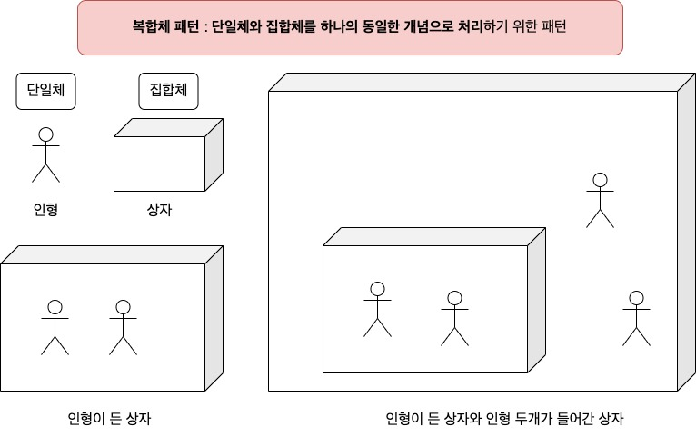
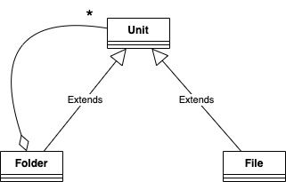
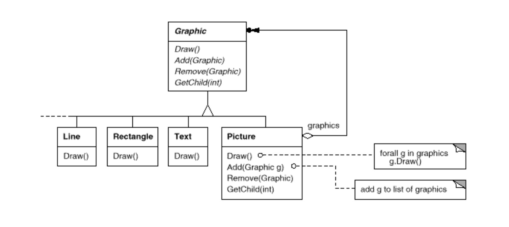
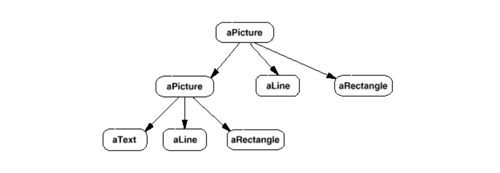

GoF의 디자인 패턴, 복합체 패턴에 대해 알아본다.

해당 글은, [다음의 코드](https://github.com/wansook0316/DesignPattern-09-Composite)를 기반으로 이해하는 것이 편리합니다.

# 핵심 요약

* 단일체와 집합체를 하나의 동일한 개념으로 처리하기 위한 패턴
* 폴더 구조, View 구조 등이 예가 될 수 있겠다.
* 부분과 전체의 계층을 표현하기 위해 객체들을 모아 트리구조로 구성한다.

# 예시

* 폴더구조를 생각해보자.
* 파일 저장 구조는 파일과 폴더 두가지로 나눌 수 있다.
* 두 타입을 하나로 묶는 unit이 있고, 이 unit에서는 이름과 크기를 지정가능하다.
* Folder의 경우에는 내부적으로 다른 파일 혹은 폴더를 가질 수 있다.
* 단일체는 파일, 집합체는 폴더가 될 것이다.
* 이런 경우, Folder는 자신에게 속한 unit을 순회하면서 크기를 구할 수 있어야 한다.
* 추가적으로 내부 파일, 폴더를 순회할 수 있어야 한다.
* 이러한 점에서 Composite 패턴은 재귀함수가 필연적으로 사용될 수 밖에 없다.
* [코드](https://github.com/wansook0316/DesignPattern-09-Composite)

# 동기

* 만약 위와 같은 구조를 사용하지 않는다고 생각해보자.
* 각각의 File과 이 File들을 갖는 Container가 있을 것이고,
* 위의 예시처럼 하나의 타입으로 관리하지 않는 경우, 두 타입자체를 관리해야 한다.
* 이 과정에서 하나의 타입으로 묶어 트리구조로 처리하는 경우 둘을 통합해서 처리할 수 있다.
* 사용하는 쪽에서는 어떤 타입인지 알 필요가 없이 하나의 `Unit` 이라는 타입으로 관리할 수 있게 된다.

# 활용성

* 부분-전체의 객체 계통을 표현하고 싶을 때
* 사용자가 객체의 합성으로 생긴 복합 객체와 개개의 객체 사이의 차이를 모르고도 일을 할 수 있도록 하고 싶을 때
  * `UIView`를 생각해보자.

# 구조

# 참여자

* Component(`Unit`)
  * 집합 관계에 정의될 모든 객체에 대한 인터페이스 정의
  * 전체 클래스에 속한 요소들을 관리하는 데 필요한 인터페이스 정의
* Leaf(`File`)
  * 가장 말단의 객체
  * 포함되는 것이 없는 객체
* Composite(`Folder`)
  * 자식이 있는 구성요소에 대한 행도 정의
* Client(`main()`)

# 협력 방법

* 사용자는 객체간의 상호작용을 위해 Component 인터페이스를 사용한다.
* Leaf 인스턴스가 요청을 받았다면, 자신이 정의한 행동을 직접 수행한다.
* Composite 인스턴스 였다면, 자식 객체들에게 요청을 위임한다.
  * 그 전에 다른 처리를 진행할 수도 있다.

# 결과

* 기본 객체와 복합 객체로 구성된 하나의 일관된 클래스 계통을 정의한다.
* 일반화된 상위 개념의 객체를 조작하여 일관되게 처리할 수 있다.
* 사용자의 코드가 단순해진다.
* 새로운 종류의 구성 요소를 쉽게 추가가능하다.

# 관련 패턴과 차이점

* 구성 요소와 부모간의 연결은 책임 연쇄 패턴에서 많이 사용된다.
* 장식자 패턴과 복합체 패턴은 함께 사용되는 경우가 많다.
* 플라이급 패턴으로 구성요소의 공유 방법을 얻을 수 있다.
* 반복자 패턴을 사용하면 구성요소를 순회하는 방법을 얻을 수 있다.

# 생각해볼 점

* View 프로그래밍에서 해당 구조를 엿볼 수 있다.
* `UIView`의 경우, View가 집합체이자 단일체가 될 수 있다.
* View의 구조를 볼 경우 위와 같은 구조로 되어 있음을 직관적으로 확인할 수 있다.
* 그래서 `hitTest`와 같은 함수는 재귀함수로 짜여있다.

# Reference

* [GoF의 디자인 패턴 - 재사용성을 지닌 객체지향 소프트웨어의 핵심요소](http://www.yes24.com/Product/Goods/17525598)
* [GoF의 Design Pattern - 9. Composite](https://www.youtube.com/watch?v=g96bJvVDZPs&list=PLe6NQuuFBu7FhPfxkjDd2cWnTy2y_w_jZ&index=25)
* [DesignPattern-09-Composite](https://github.com/wansook0316/DesignPattern-09-Composite)
* [컴포지트 패턴](https://ko.wikipedia.org/wiki/%EC%BB%B4%ED%8F%AC%EC%A7%80%ED%8A%B8_%ED%8C%A8%ED%84%B4)
