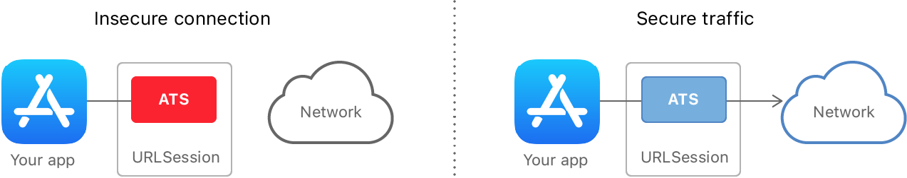

예전에 네트워크 처리를 하면서 맞닥들였던 문제를 다시한번 적어본다. 그리고 그 개념까지 간단하게 정리해본다.

# Problem

````
App Transport Security has blocked a cleartext HTTP resource load since it is insecure. Temporary exceptions can be configured via your app's Info.plist file.
````

이런 에러를 본 적이 있다. 결론적으로 보안에 취약한, 즉 HTTP를 사용할 경우 보안설정을 바꿔주어야 한다는 에러이다.

# Solution

당장 문제를 해결하기 위해서는 다음과 같은 조치를 취해주면 된다. `Inpo.plist`에서 다음과 같이 설정해주자.


# App Transport Security

이제 App Transport Security 이녀석이 무엇인지 알아볼 필요가 있다.



다양한 종류의 App이 개인 정보를 다루게 되면서, 사용자 정보 보호에 대한 중요성이 높아졌다. 기존의 보안/암호 기술이 오래되면서 공격에 취약해졌고, 그에 비해 컴퓨터 성능은 비약적으로 발전하면서 새로운 네트워크 공격에 대응이 필요했다. 이에 2015년 도입하게 된다. 2016년 이후부터 새롭게 만들어지는 App은 반드시 ATS를 사용해야 한다고 한다.

기본적으로 `URLSession`, `CFURL`, `NSURLConnection` API를 이용하여 데이터를 주고 받는 경우 ATS 기능이 기본적으로 켜져있다. ATS 기능이 켜져있다면 HTTP 통신이 불가능하다. Apple에서 권장하는 요구사항은 다음과 같다.

* Server: TLS(Transport Layer Security) protocol version >= 1.2
* 2048bit 이상의 RSA Key Or ECC Key가 있는 SHA256을 인증서에 사용

자세한 내용은 [Preventing Insecure Network Connections](https://developer.apple.com/documentation/security/preventing_insecure_network_connections)을 참고하자.

 > 
 > [TLS(Transport Layer Security)](https://namu.wiki/w/TLS): 인터넷에서의 정보를 암호화해서 송수신하는 프로토콜 <br> [HTTPS](https://namu.wiki/w/TLS?from=HTTPS#s-1.2): TLS위에 HTTP을 얹은 보안된 HTTP 통신을 하는 Protocol

# Exception

보통은 ATS를 켜는 것이 당연히 좋다. 그런데 다음과 같은 예외의 경우 ATS를 비활성화 할 수 있다.

* AVFoundation 프레임워크를 통한 스트리밍 서비스
* WebKit을 통한 콘텐츠 요청
* 로컬 네트워크 연결

이 외에 임시적으로 유지보수를 위해 ATS를 사용하지 않을 수 있지만, AppStore 심사시에는 이를 위한 정당한 이유가 필요할 수 있다.

# 마무리

간단하게 ATS 문제해결 방법과 무엇인지에 대해 알아보았다. 끝!

# Reference

* [ATS(App Transport Security)란?](https://www.zehye.kr/ios/2020/04/09/14iOS_ats/)
* [NSAppTransportSecurity](https://developer.apple.com/documentation/bundleresources/information_property_list/nsapptransportsecurity)
* [Preventing Insecure Network Connections](https://developer.apple.com/documentation/security/preventing_insecure_network_connections)
* [전송 계층 보안](https://ko.wikipedia.org/wiki/%EC%A0%84%EC%86%A1_%EA%B3%84%EC%B8%B5_%EB%B3%B4%EC%95%88)
* [TLS](https://namu.wiki/w/TLS)
